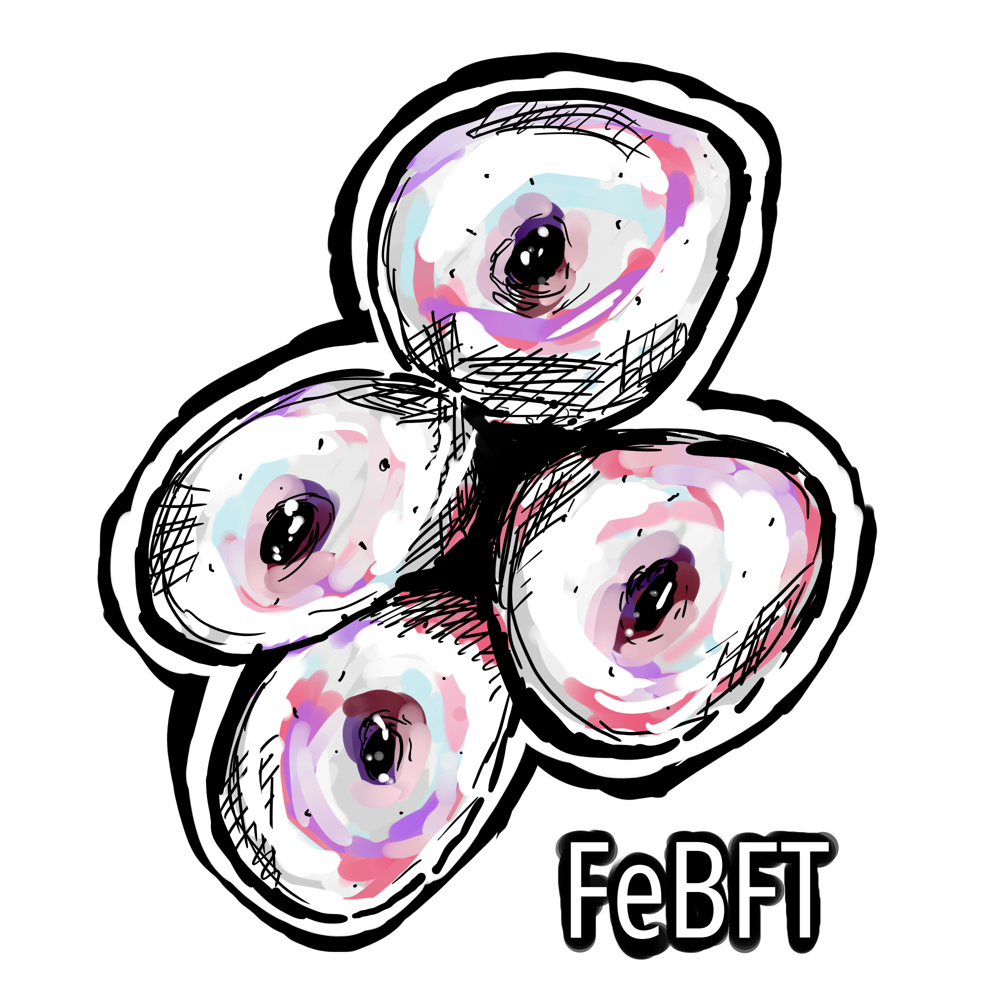

A rusty, efficient Byzantine fault tolerant ordering protocol.
<!-- TODO: include crates.io, docs.rs links here, etc -->

---

# A bit of context

FeBFT is an efficient BFT SMR middleware library implementation, directly descendant
of protocols such as PBFT and BFT-SMaRt, where a static group of `n = 3f + 1` nodes
are responsible for replicating a service, that is usually exposed via a RPC interface.
The properties of these systems are such that despite the failure of (up to) `f` nodes
(due to software bugs, power outages, malicious attackers, etc) the service abstraction
will continue operating as usual.

There are infinitely many use cases for BFT systems, which will undoubtedly improve the
availability of a digital service. However, a less robust class of systems, called CFT
systems, are often utilized in place of BFT systems, based on their greater performance.
Despite this, with the evolution of hardware, and especially the growing popularity of
blockchain technology, BFT systems are becoming more attractive to distributed system
developers.

People who are interested in the inner workings of these protocols can
consult the following papers:

* Castro, Miguel, and Barbara Liskov. "Practical Byzantine fault tolerance and proactive recovery." ACM Transactions on Computer Systems (TOCS) 20.4 (2002): 398-461.
* Bessani, Alysson, Joao Sousa, and Eduardo EP Alchieri. "State machine replication for the masses with BFT-SMART." 2014 44th Annual IEEE/IFIP International Conference on Dependable Systems and Networks. IEEE, 2014.

<!-- TODO: include link to thesis 
To read more about the architecture of FeBFT, you can check out my MsC thesis.-->
# Quick glimpse on performance

Coming soon.

### For more information about FeBFT, please visit the wiki here: https://github.com/SecureSolutionsLab/febft/wiki .
